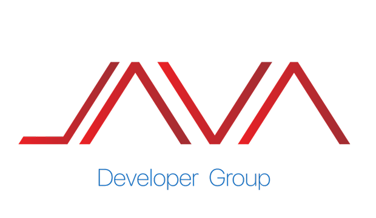

# 🚀 JavaDev - Java Developer Group

<p align="center">
  
</p>

<p align="center">
  <strong>A Continuous Journey to Create, Learn, and Evolve</strong>
</p>

<p align="center">
  
  
  
  
</p>

---

## 📖 Tentang JavaDev

**JAVADEV** merupakan komunitas penggerak inovasi yang menghubungkan mahasiswa dari berbagai bidang untuk bersama-sama menciptakan solusi digital. Kami berfokus pada pengembangan keterampilan teknis, desain, dan kolaboratif agar setiap anggota siap menghadapi tantangan industri masa depan.

### 🎯 Visi & Misi

**Visi:**  
Menjadi komunitas developer terdepan yang membentuk generasi pembuat solusi digital yang inovatif dan siap menghadapi tantangan dunia teknologi.

**Misi:**

-   🔨 **Build** - Membangun proyek nyata yang berdampak
-   📚 **Learn** - Belajar teknologi terkini secara berkelanjutan
-   🤝 **Collaborate** - Berkolaborasi dengan sesama developer
-   🔄 **Repeat** - Terus berkembang dalam siklus pembelajaran

---

## ✨ Fitur Utama

-   🎓 **Kelas & Workshop** - Program pembelajaran terstruktur untuk meningkatkan skill
-   📅 **Event & Meetup** - Pertemuan rutin untuk networking dan sharing knowledge
-   💼 **Portfolio Showcase** - Platform untuk menampilkan karya dan proyek
-   🏆 **Leaderboard** - Sistem gamifikasi untuk memotivasi pembelajaran
-   👥 **Mentor Program** - Bimbingan dari developer berpengalaman
-   🎯 **Project-Based Learning** - Belajar melalui proyek nyata

---

## 🛠️ Tech Stack

### Backend

-   **Laravel 11.x** - PHP Framework
-   **PHP 8.2+** - Programming Language
-   **SQLite** - Database (Development)

### Frontend

-   **Blade Templates** - Templating Engine
-   **Tailwind CSS 3.x** - Utility-First CSS Framework
-   **Vite 5.x** - Frontend Build Tool
-   **Alpine.js** (Optional) - Lightweight JavaScript Framework

### Tools & Services

-   **Composer** - PHP Dependency Manager
-   **NPM** - Node Package Manager
-   **Git** - Version Control

---

## 🚀 Quick Start

### Prerequisites

Pastikan kamu sudah menginstall:

-   PHP >= 8.2
-   Composer
-   Node.js & NPM
-   Git

### Installation

1. **Clone Repository**

    ```bash
    git clone https://github.com/yourusername/javadev.git
    cd javadev
    ```

2. **Install Dependencies**

    ```bash
    # Install PHP dependencies
    composer install

    # Install Node dependencies
    npm install
    ```

3. **Environment Setup**

    ```bash
    # Copy environment file
    cp .env.example .env

    # Generate application key
    php artisan key:generate
    ```

4. **Database Setup**

    ```bash
    # Run migrations
    php artisan migrate

    # Seed database (optional)
    php artisan db:seed
    ```

5. **Build Assets**

    ```bash
    # Development
    npm run dev

    # Production
    npm run build
    ```

6. **Start Development Server**

    ```bash
    php artisan serve
    ```

    Aplikasi akan berjalan di `http://localhost:8000`

---

## 📁 Project Structure

```
javadev/
├── app/
│   ├── Http/
│   │   └── Controllers/     # Application controllers
│   ├── Models/              # Eloquent models
│   └── Providers/           # Service providers
├── database/
│   ├── migrations/          # Database migrations
│   └── seeders/             # Database seeders
├── public/
│   ├── assets/              # Static assets (images, icons, patterns)
│   └── build/               # Compiled assets
├── resources/
│   ├── css/                 # CSS files
│   ├── js/                  # JavaScript files
│   └── views/               # Blade templates
├── routes/
│   └── web.php              # Web routes
└── vite.config.js           # Vite configuration
```

---

## 🎨 Design System

### Colors

-   **Primary Blue**: `#2B7FFF` - Main brand color
-   **Secondary Blue**: `#246CF9` - Buttons & accents
-   **Background**: `#F5F7FB` - Page background
-   **Text**: `#111827` - Primary text color

### Typography

-   **Font Family**: System fonts (sans-serif)
-   **Headings**: Bold, large sizes
-   **Body**: Regular weight, readable sizes

---

## 👥 Untuk Siapa?

### 🎓 Mahasiswa

Mahasiswa yang ingin mengembangkan skill programming, belajar teknologi baru, dan membangun portfolio untuk karir di industri teknologi.

### 👨‍🏫 Mentor

Developer berpengalaman yang ingin berbagi ilmu, membimbing generasi muda, dan berkontribusi dalam ekosistem developer Indonesia.

---

## 🤝 Contributing

Kami sangat terbuka untuk kontribusi! Jika kamu ingin berkontribusi:

1. Fork repository ini
2. Buat branch baru (`git checkout -b feature/AmazingFeature`)
3. Commit perubahan (`git commit -m 'Add some AmazingFeature'`)
4. Push ke branch (`git push origin feature/AmazingFeature`)
5. Buat Pull Request

---

## 📞 Contact

-   **Email**: hello@javadevgroup@gmail.com
-   **Phone**: +62123456789
-   **Address**: Jl. Kedung Baruk No. 98 Surabaya
-   **Instagram**: [@javadevgroup](https://instagram.com/javadevgroup)
-   **YouTube**: [JavaDev Channel](https://youtube.com/@javadevgroup)

---

## 📄 License

This project is licensed under the MIT License - see the [LICENSE](LICENSE) file for details.

---

## 🙏 Acknowledgments

-   **Universitas Dinamika** - Supporting institution
-   **Laravel Community** - Amazing framework and community
-   **All Contributors** - Thank you for your contributions!

---

<p align="center">
  Made with ❤️ by <strong>Java Developer Group</strong>
</p>

<p align="center">
  Copyright ©2025 | Java Developer Group
</p>
